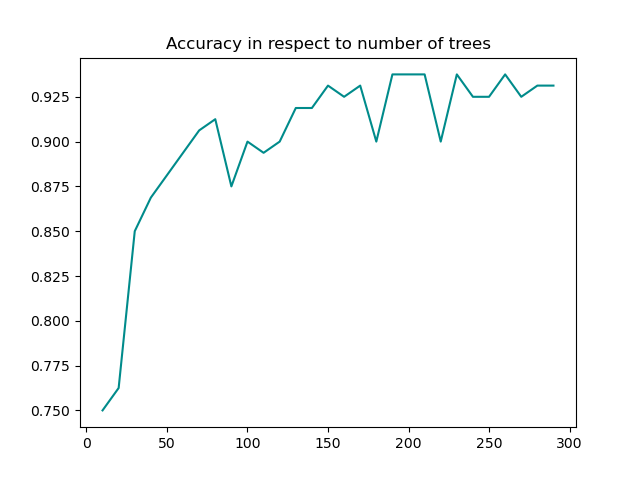

# wieik-si-lab-04

## Task 1

Compare decision tree regressor with any other regressor.


## Task 2

### Check influence of number of trees



### Compare Random Forest with any other classifier (eg. logistic regression)

```
[RandomForestClassifier]  time of training: 4.98  accuracy:  0.84375
[LogisticRegression]      time of training: 5.07  accuracy:  0.9125
```

### Compare Gini and Entropy

```
[1][Gini] accuracy:  0.525
[1][Entropy] accuracy:  0.45
[2][Gini] accuracy:  0.525
[2][Entropy] accuracy:  0.4625
[3][Gini] accuracy:  0.525
[3][Entropy] accuracy:  0.475
[4][Gini] accuracy:  0.53125
[4][Entropy] accuracy:  0.45
```

# Notes

## Random Forests

> Trees have one aspect that prevents them from being the ideal tool for predictive learning, namely **inaccuracy**.

Random Forests combines the simplicity of decision trees with flexibility.

## Bootstrapping

Results in a wide variety of trees, thus making random forests more effective than decision trees.

Bootstrapping allows duplicates.

Entries not included in bootstrapped dataset is called **Out-Of-Bag Dataset**, therefore is being used to check accuracy.

## Bagging

Bootstrapping the data plus using the aggregate to make a decision.

## Missing data

### in the original dataset

Guess (avg) and refine by determining similar entries (proximity matrix of samples) till values converge. ...

Proximity matrix -> distance matrix -> heatmap.

### in sample to categorize

Consider all predictions. Use method described above for all predictions. Compare by how many times null was correctly labeled.

## Regression Trees

Data is split by finding the threshold that gave the smallest sum of squared residuals (SSR) across all features.

### Preventing overfitting

- minimum number to split
